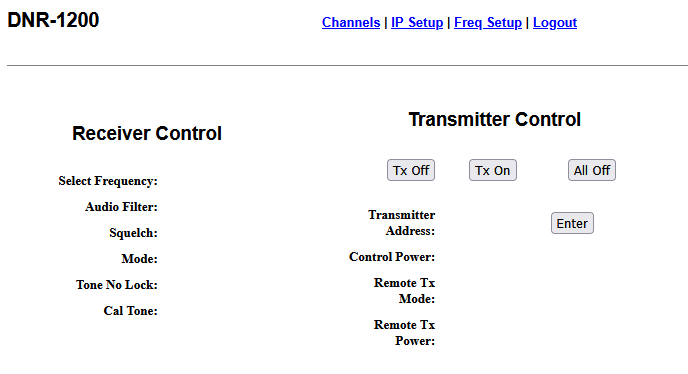

REM_RX_GUI Remote Receiver GUI
 
This is a web based GUI embedded in a prototype product. 
The webserver is written in C++/HTML for a Netburner SB70C card (implementing Freescale ARM) and interfaces to a radio, allowing real-time audio and remote control of the radio functions. 
 
This demonstrates use of webpage controls, and implements AJAX (Asynchronous Javascript and XML) for smooth update of displays (RSSI and audio signal level).  

